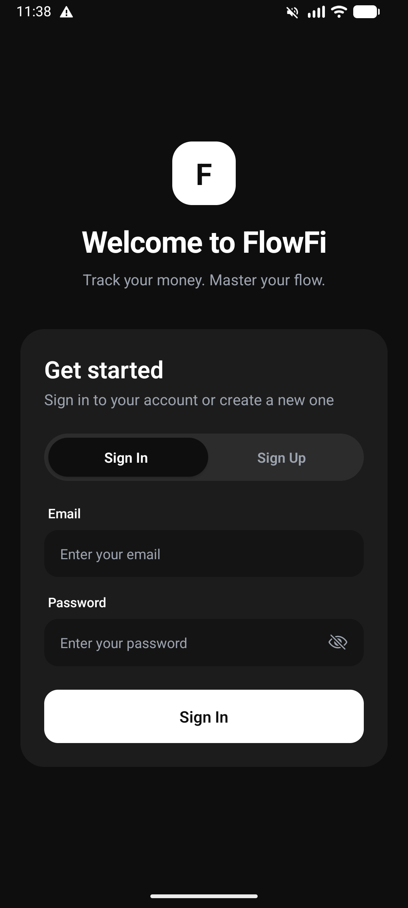
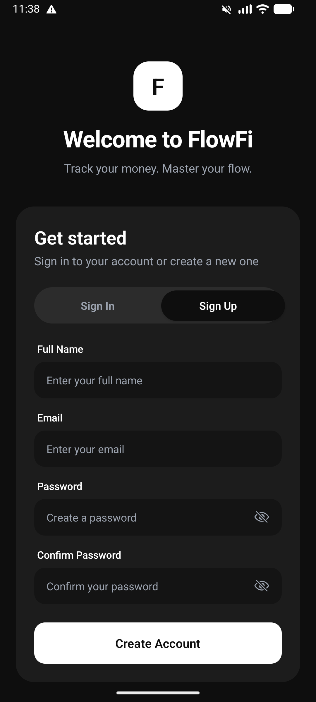
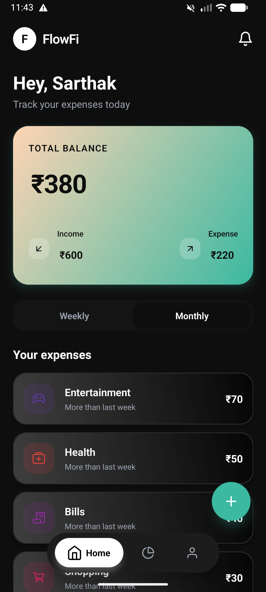
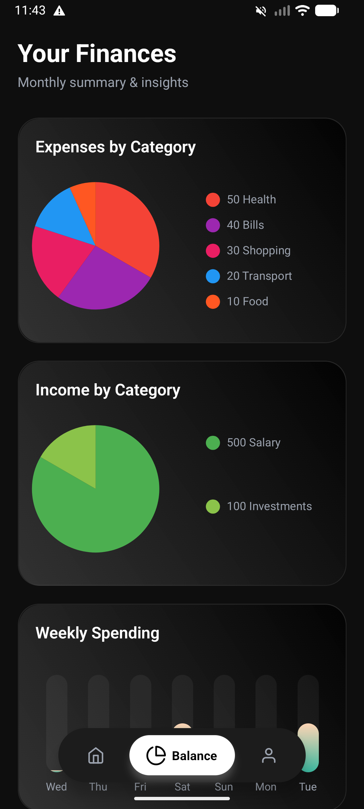
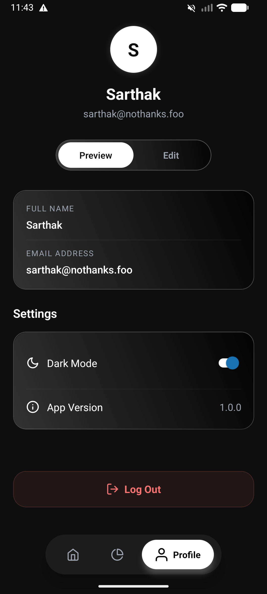

# FlowFi - Personal Finance Manager

FlowFi is a modern, intuitive, and feature-rich personal finance management application built with Expo and React Native. It helps users track their income, expenses, and overall financial health with a clean and customizable interface.

## 🌟 Features

- **Dashboard:** Get a quick overview of your total balance, recent transactions, and spending categories.
- **Transaction Management:** Easily add, edit, or delete transactions (both income and expenses).
- **Categorization:** Group transactions into custom categories with unique icons and colors.
- **Insightful Charts:** Visualize your spending habits with interactive bar and pie charts.
- **Theming:** Full support for both **Light** and **Dark** modes, automatically adapting to your system preferences or manually togglable.
- **Swipe Actions:** Intuitive swipe-to-delete gestures for managing transactions.
- **Offline Support:** Data is stored locally using AsyncStorage, ensuring your financial info is always accessible without an internet connection.

## 📸 Screenshots

<div style="display: flex; flex-direction: row; flex-wrap: wrap; gap: 10px;">
  
  
  
  
  
</div>

## 🚀 Setup Instructions

Follow these steps to run the project locally on your machine.

### Prerequisites

- Node.js (v18 or newer recommended)
- npm or yarn or pnpm
- Expo CLI
- iOS Simulator or Android Emulator (or the Expo Go app on your physical device)

### 1. Clone the repository
```bash
git clone https://github.com/ssaarthakk/finance-manager.git
cd finance-manager
```

### 2. Install dependencies
```bash
npm install
# or
yarn install
```

### 3. Start the application
```bash
npx expo start
```

This will start the Expo development server. From the terminal or the Expo Dev Tools browser tab, you can choose to run the app on an Android emulator, iOS simulator, or scan the QR code with the Expo Go app on your mobile device.

## 🛠️ Technologies Used

- **Framework:** [React Native](https://reactnative.dev/) & [Expo](https://expo.dev/)
- **Navigation:** [Expo Router](https://docs.expo.dev/router/introduction/) & React Navigation
- **State Management:** [Zustand](https://github.com/pmndrs/zustand)
- **Animations:** [React Native Reanimated](https://docs.swmansion.com/react-native-reanimated/)
- **Forms & Validation:** [React Hook Form](https://react-hook-form.com/)
- **Charts:** [React Native Chart Kit](https://github.com/indiespirit/react-native-chart-kit)
- **Storage:** [@react-native-async-storage/async-storage](https://react-native-async-storage.github.io/async-storage/)